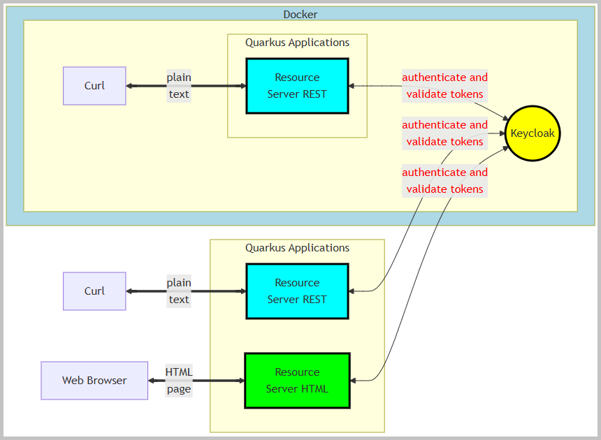
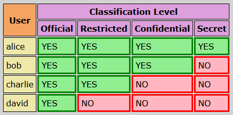
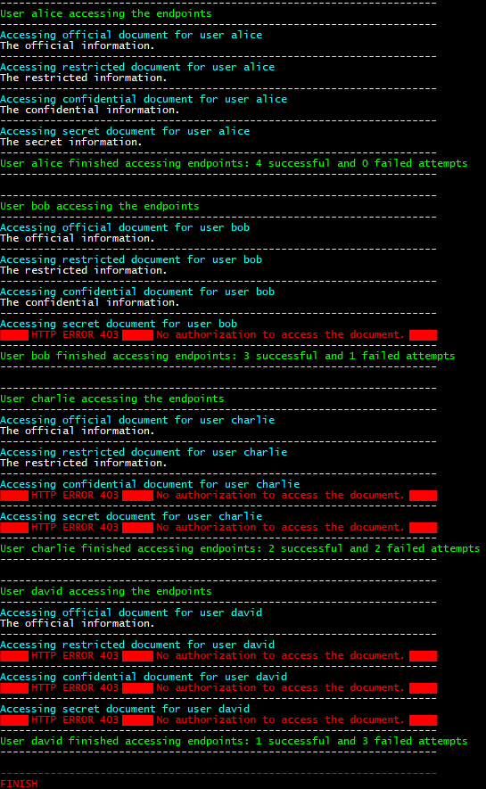

<!DOCTYPE html>
<html lang="en">
<meta charset="UTF-8">
<body>

<h2 id="contents">Study24 README Contents</h2>

<h3 id="top">Research <a href="https://www.keycloak.org/getting-started/getting-started-docker">Keycloak</a>
    and <a href="https://quarkus.io/">Quarkus</a></h3>

    Authorization decisions are delegated to Keycloak, an OAuth 2.0-compliant authorization server.

    This project consists of two Quarkus applications,
    each designed to serve a distinct purpose within the architecture:

<ol>
    <li><i>resource-server-rest</i> - serves as an OAuth2 Resource Server,
        handling secure RESTful API requests and ensuring proper authorization.</li>
    <li><i>resource-server-html</i> - operates as an OAuth2 Resource Server,
        focused on securely delivering HTML content and managing browser-based interactions.</li>
</ol>

    The project leverages the OAuth2 protocol to provide secure access control,
    ensuring that only authorized clients can interact with the resources.
    The resource access permissions are configured directly in Keycloak.
    Quarkus applications use bearer token authorization.
    Refer to the <a href="https://quarkus.io/guides/security-oidc-bearer-token-authentication#overview-of-the-bearer-token-authentication-mechanism-in-quarkus">
    'Bearer token authentication mechanism'</a> diagram.

    The Keycloak Authorization extension ('quarkus-keycloak-authorization' Maven dependency)
    extends the OpenID Connect extension ('quarkus-oidc' Maven dependency).

    Sections of this project:

<ol>
    <li><a href="#ONE"><b>Docker Build</b></a></li>
    <li><a href="#TWO"><b>Curl Client on Docker</b></a></li>
    <li><a href="#THREE"><b>Local Curl Client</b></a></li>
    <li><a href="#FOUR"><b>Local Build</b></a></li>
    <li><a href="#FIVE"><b>Web Browser Client</b></a></li>
</ol>

    Java source code packages: 
     
    
    <i>project 'Study24-resource-server-rest', application sources</i>&nbsp;:&nbsp;
    <a href="https://github.com/k1729p/Study24/tree/main/resource-server-rest/src/main/java/kp">kp</a> 
    
    <i>project 'Study24-resource-server-rest', test sources</i>&nbsp;:&nbsp;
    <a href="https://github.com/k1729p/Study24/tree/main/resource-server-rest/src/test/java/kp">kp</a> 
    
    <i>project 'Study24-resource-server-html', application sources</i>&nbsp;:&nbsp;
    <a href="https://github.com/k1729p/Study24/tree/main/resource-server-html/src/main/java/kp">kp</a> 
    

     
    
    <i>project 'Study24-resource-server-rest'</i>&nbsp;:&nbsp;
    <a href="https://htmlpreview.github.io/?https://github.com/k1729p/Study24/blob/main/resource-server-rest/docs/apidocs/overview-tree.html">
        Java API Documentation</a>&nbsp;●&nbsp;
    <a href="https://htmlpreview.github.io/?https://raw.githubusercontent.com/k1729p/Study24/main/resource-server-rest/docs/testapidocs/kp/resource/server/controllers/package-summary.html">
        Java Test API Documentation</a> 
    
    <i>project 'Study24-resource-server-html'</i>&nbsp;:&nbsp;
    <a href="https://htmlpreview.github.io/?https://github.com/k1729p/Study24/blob/main/resource-server-html/docs/apidocs/overview-tree.html">
        Java API Documentation</a> 
    

<h3 id="ONE">❶ Docker Build</h3>

Action: 
     
     Use the batch file
    <a href="https://github.com/k1729p/Study24/blob/main/0_batch/01%20MVN%20build%20and%20Docker%20compose.bat">
        <i>"01 MVN build and Docker compose.bat"</i></a> to build the images and 
    start the containers. 
    

    1.1. Docker images are built using the following files:

<ul>
    <li><a href="https://raw.githubusercontent.com/k1729p/Study24/main/docker-config/Resource-Server-Rest.Dockerfile">
        <b>Resource-Server-Rest.Dockerfile</b></a></li>
    <li><a href="https://raw.githubusercontent.com/k1729p/Study24/main/docker-config/compose.yaml">
        <b>compose.yaml</b></a></li>
</ul>

    1.2. The <a href="images/ScreenshotDockerContainers.png">screenshot</a>
    shows the created Docker containers.

    1.3. The resource servers manage documents classified under four classification levels.
    Four users are assigned specific roles corresponding to their access levels.

    

    1.4. Keycloak
    <a href="https://raw.githubusercontent.com/k1729p/Study24/refs/heads/main/0_batch/helpers/realm_export/keycloak_settings_for_quarcus_realm.txt">
        realm 'quarkus'</a> configuration.

<a href="#top">Back to the top of the page</a>

<h3 id="TWO">❷ Curl Client on Docker</h3>

Action: 
     
     Use the batch file
    <a href="https://github.com/k1729p/Study24/blob/main/0_batch/02%20CURL%20on%20Docker.bat">
        <i>"02 CURL on Docker.bat"</i></a> to execute the shell script
    <a href="https://raw.githubusercontent.com/k1729p/Study24/refs/heads/main/docker-config/tests/call_endpoints.sh">
        call_endpoints.sh</a>. 
    

    2.1.1. The <b>Official Document</b> endpoint: 'http://localhost:8081/api/document/official/rest'. 
    The controller method:
    <a href="https://github.com/k1729p/Study24/blob/main/resource-server-rest/src/main/java/kp/resource/server/controllers/DocumentController.java#L42">
        kp.resource.server.controllers.DocumentController::getOfficialDocument</a>.

    2.1.2. The <b>Restricted Document</b> endpoint: 'http://localhost:8081/api/document/restricted/rest'. 
    The controller method:
    <a href="https://github.com/k1729p/Study24/blob/main/resource-server-rest/src/main/java/kp/resource/server/controllers/DocumentController.java#L55">
        kp.resource.server.controllers.DocumentController::getRestrictedDocument</a>.

    2.1.3. The <b>Confidential Document</b> endpoint: 'http://localhost:8081/api/document/confidential/rest'. 
    The controller method:
    <a href="https://github.com/k1729p/Study24/blob/main/resource-server-rest/src/main/java/kp/resource/server/controllers/DocumentController.java#L68">
        kp.resource.server.controllers.DocumentController::getConfidentialDocument</a>.

    2.1.4. The <b>Secret Document</b> endpoint: 'http://localhost:8081/api/document/secret/rest'. 
    The controller method:
    <a href="https://github.com/k1729p/Study24/blob/main/resource-server-rest/src/main/java/kp/resource/server/controllers/DocumentController.java#L81">
        kp.resource.server.controllers.DocumentController::getSecretDocument</a>.

    2.2. The results of the shell script 'call_endpoints.sh' execution.

     
    
    <i>Screenshot of the console log from the batch file "02 CURL on Docker.bat".</i>

<a href="#top">Back to the top of the page</a>

<h3 id="THREE">❸ Local Curl Client</h3>

Action: 
     
     1. Use the batch file
    <a href="https://github.com/k1729p/Study24/blob/main/0_batch/03%20MVN%20run%20REST%20local.bat">
        <i>"03 MVN run REST local.bat"</i></a>. 
    
    &nbsp; to start the application 'resource server rest' locally. 
     2. Start the Windows batch script
    <a href="https://github.com/k1729p/Study24/blob/main/0_batch/04%20CURL%20on%20local.bat">
        <i>"04 CURL on local.bat"</i></a>. 
    

    3.1.1. The <b>Official Document</b> endpoint: 'http://localhost:9091/api/document/official/rest'.

    3.1.2. The <b>Restricted Document</b> endpoint: 'http://localhost:9091/api/document/restricted/rest'.

    3.1.3. The <b>Confidential Document</b> endpoint: 'http://localhost:9091/api/document/confidential/rest'.

    3.1.4. The <b>Secret Document</b> endpoint: 'http://localhost:9091/api/document/secret/rest'.

    3.2. The <a href="images/ScreenshotCurlLocal.png">screenshot</a>
    shows the console log from the batch file "04 CURL on local.bat". 

<h3 id="FOUR">❹ Local Build</h3>

Action: 
     
     Use the batch file
    <a href="https://github.com/k1729p/Study24/blob/main/0_batch/05%20MVN%20build%20and%20run%20HTML%20local.bat">
        <i>"05 MVN build and run HTML local.bat"</i></a> to build and 
    
    &nbsp; start the application 'resource server html' locally. 
    

<a href="#top">Back to the top of the page</a>

<h3 id="FIVE">❺ Web Browser Client</h3>

Action: 
     
     Open the file
    <a href="https://github.com/k1729p/Study24/blob/main/0_batch/Links.html">Links.html</a> in a web browser. 
    

    5.1. The GitHub preview in a browser of the page
    <a href="https://htmlpreview.github.io/?https://github.com/k1729p/Study24/blob/main/0_batch/Links.html">
        Links</a>.

    5.2. The <a href="images/ScreenshotKeycloakLoginAuthentication.png">screenshot</a>
    shows Keycloak's login authentication page.

    These document endpoints use Keycloak's authorization configurations, requiring the roles
    defined in the Keycloak realm 'quarkus' to enforce role-based access control.

    5.3.1. The <b>Official Document</b> endpoint: 'http://localhost:9092/api/document/official/html'.

    The controller method:
    <a href="https://github.com/k1729p/Study24/blob/main/resource-server-html/src/main/java/kp/resource/server/controllers/DocumentController.java#L44">
        kp.resource.server.controllers.DocumentController::getOfficialDocument</a>. 

    The <a href="images/ScreenshotOfficialDocument.png">screenshot</a>
    shows the result from the endpoint 'http://localhost:9092/api/document/official/html'.

    5.3.2. The <b>Restricted Document</b> endpoint: 'http://localhost:9092/api/document/restricted/html'.

    The controller method:
    <a href="https://github.com/k1729p/Study24/blob/main/resource-server-html/src/main/java/kp/resource/server/controllers/DocumentController.java#L59">
        kp.resource.server.controllers.DocumentController::getRestrictedDocument</a>. 

    The <a href="images/ScreenshotRestrictedDocument.png">screenshot</a>
    shows the result from the endpoint 'http://localhost:9092/api/document/restricted/html'. 

    5.3.3. The <b>Confidential Document</b> endpoint: 'http://localhost:9092/api/document/confidential/html'.

    The controller method:
    <a href="https://github.com/k1729p/Study24/blob/main/resource-server-html/src/main/java/kp/resource/server/controllers/DocumentController.java#L74">
        kp.resource.server.controllers.DocumentController::getConfidentialDocument</a>. 

    The <a href="images/ScreenshotConfidentialDocument.png">screenshot</a>
    shows the result from the endpoint 'http://localhost:9092/api/document/confidential/html'. 

    5.3.4. The <b>Secret Document</b> endpoint: 'http://localhost:9092/api/document/secret/html'.

    The controller method:
    <a href="https://github.com/k1729p/Study24/blob/main/resource-server-html/src/main/java/kp/resource/server/controllers/DocumentController.java#L89">
        kp.resource.server.controllers.DocumentController::getSecretDocument</a>. 

    The <a href="images/ScreenshotSecretDocument.png">screenshot</a>
    shows the result from the endpoint 'http://localhost:9092/api/document/secret/html'. 

    5.4. The <b>Resource Server Information</b> endpoint: 'http://localhost:9092/api/info'.

    The controller method:
    <a href="https://github.com/k1729p/Study24/blob/main/resource-server-html/src/main/java/kp/resource/server/controllers/ResourceServerInfoController.java#L62">
        kp.resource.server.controllers.ResourceServerInfoController::info</a>. 

    The <a href="images/ScreenshotResourceServerInformation.png">screenshot</a>
    shows the result from the endpoint 'http://localhost:9092/api/info'. 

    5.5. The <b>Unrestricted</b> endpoint: 'http://localhost:9092/unrestricted'.

    The controller method:
    <a href="https://github.com/k1729p/Study24/blob/main/resource-server-html/src/main/java/kp/resource/server/controllers/UnrestrictedResourceController.java#L60">
        kp.resource.server.controllers.UnrestrictedResourceController::getUnrestrictedResource</a>. 

    The <a href="images/ScreenshotUnrestrictedAccess.png">screenshot</a>
    shows the result from the endpoint 'http://localhost:9092/unrestricted'. 

<a href="#top">Back to the top of the page</a>

</body>
</html>