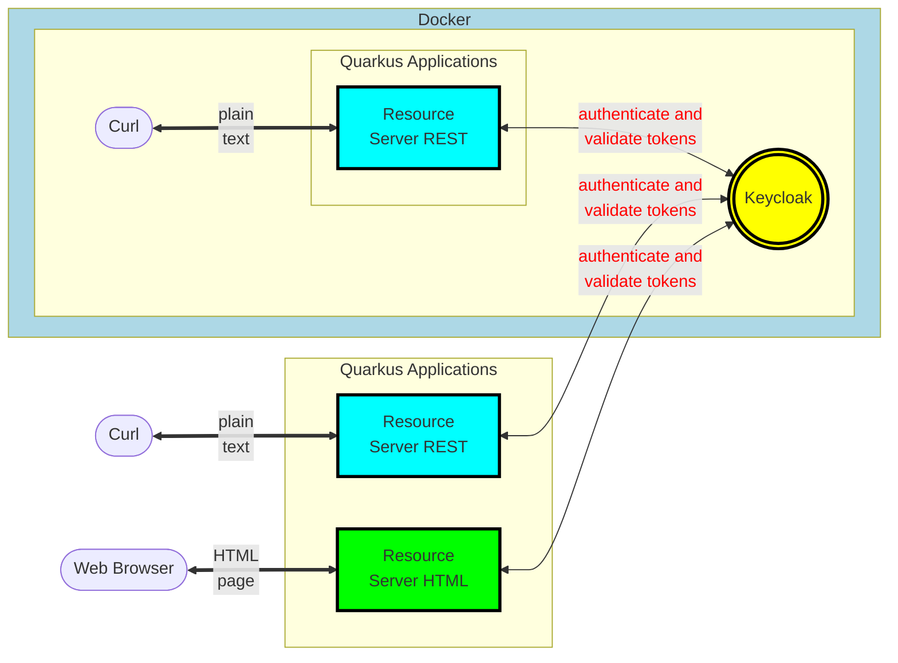

```mermaid
flowchart LR
    subgraph Docker
        subgraph " "
            CURL-D([Curl])
            subgraph Quarkus Applications
                D-RSR[Resource<br> Server REST]:::cyanBox
            end
            KCK(((Keycloak))):::yellowBox
        end
    end
    subgraph Quarkus Applications
        L-RSH[Resource<br> Server HTML]:::greenBox
        L-RSR[Resource<br> Server REST]:::cyanBox
    end
    WBR([Web Browser])
    CURL([Curl])
%% Flows
    D-RSR <-- authenticate and<br> validate tokens --> KCK
    L-RSR <-- authenticate and<br> validate tokens --> KCK
    L-RSH <-- authenticate and<br> validate tokens --> KCK
    CURL-D <== plain<br> text ==> D-RSR
    WBR <== HTML<br> page ==> L-RSH
    CURL <== plain<br> text ==> L-RSR
%% Style Definitions
    style Docker fill: lightblue
    linkStyle 0,1,2 color: red;
    classDef greenBox fill: #00ff00, stroke: #000, stroke-width: 3px
    classDef cyanBox fill: #00ffff, stroke: #000, stroke-width: 3px
    classDef yellowBox fill: #ffff00, stroke: #000, stroke-width: 3px
```